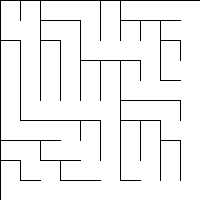
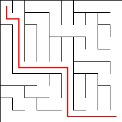
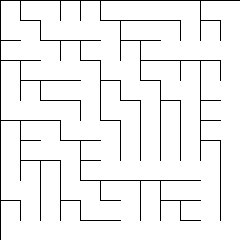
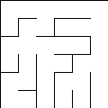
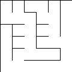
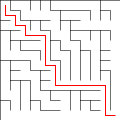
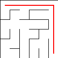
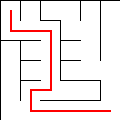

# Maze Generating and Solving
This project incorporates what is known as, Dijkstra's algorithm to find the shortest path possible
path through a maze in which is generated via Binary Tree, Sidewinder, and Eller.

Here is an example of a maze that can be generated

And here is that very maze solved

## Overview
I've incorporated several aspects to each maze. Each maze is represented as a graph in which, contains a grid of cells
where each cell (node) has a link (edge) to all of its neighboars. These edges are known as wall's and/or passages in
this context. If a node **DOES NOT** have a neighbor to the north, east, south, or west, it does not function preoprly.
With this information, I have incorporated several classes in which are used to help generate mazes and solve them.

Utility classes that every maze consists of are the following,

* **Grid**: The grid of the maze in which consists of many Cells

* **Cell**: A singular cell (or square portion in the graph) that acts as a node

Classes representing Algorithms that create and solve mazes,

* **BinaryTreeMazeMaker**: An algorithm in which will create a maze for a provided grid

Here is an example of what it creates,

* **SidewinderMazeMaker**: A slightly more interesting algorithm to make a maze of a provided grid.

Here is an example of what it creates,

* **EllerMazeMaker**: Incorporates "Eller's Algorithm" creating a maze with one row at a time.

Here is an example of what it creates,

    

* **DjikstraSolve**: A widley known algorithm for finding the shortest paths between nodes in a weighted graph (Created by yours truly).

Here is an example of a solved Binary Tree Maze,

Here is an example of a solved Side Winder Maze,

Here is an example of a solved Eller Maze Maze,

## References
Several Python packages were incorporated in this project to help make the process smoother

**Pytest**: Framework used for testing. More information found [here](https://docs.pytest.org/en/7.4.x/)

**Pillow**: Famous Imaging Library. More information found [here](https://pillow.readthedocs.io/en/stable/)

## License
**Copyright (c) 2023 Jordan Fraser. All rights reserved.